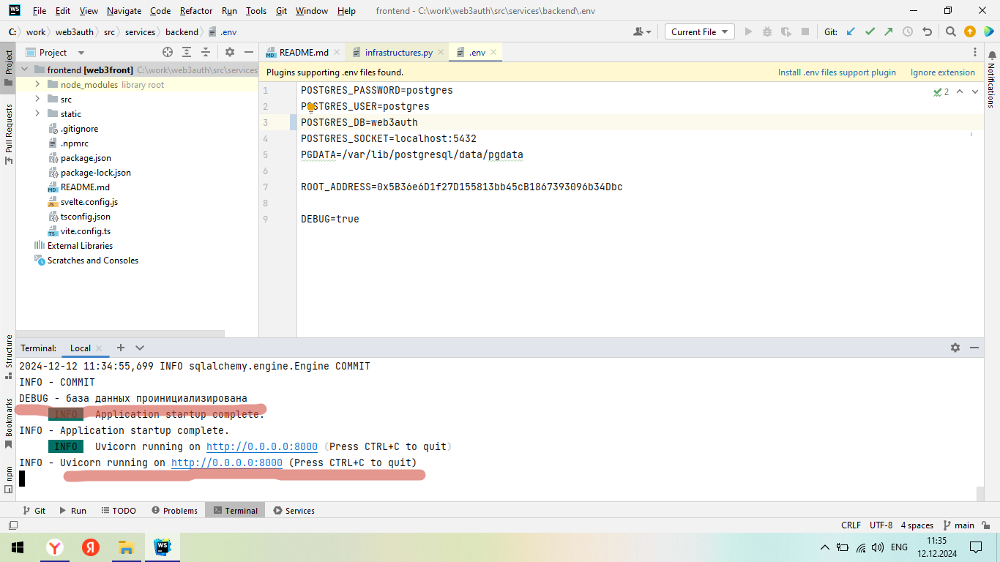
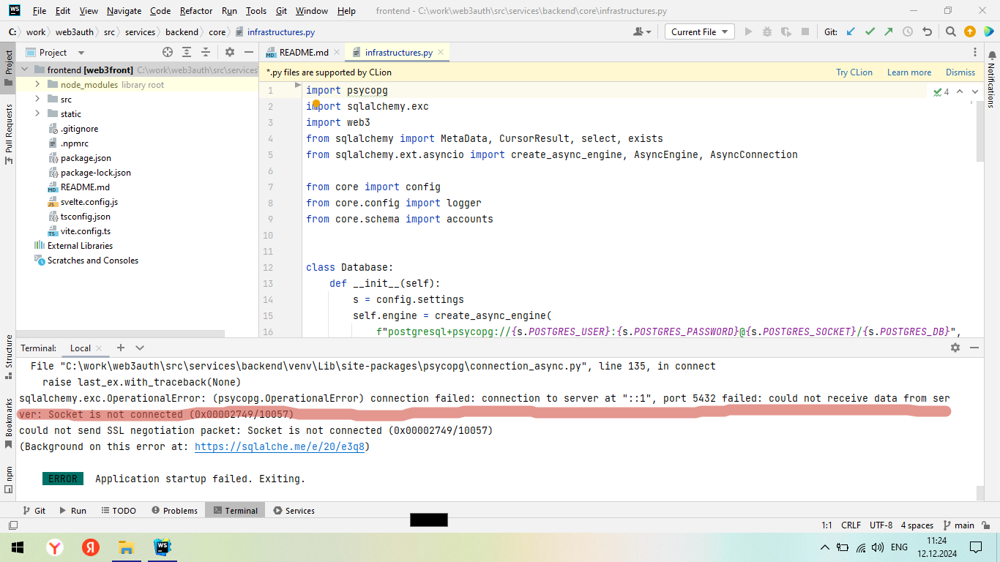
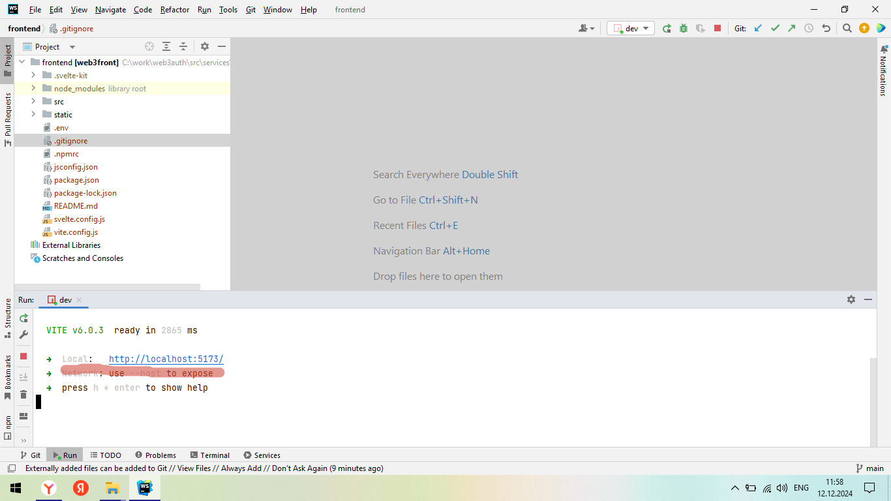
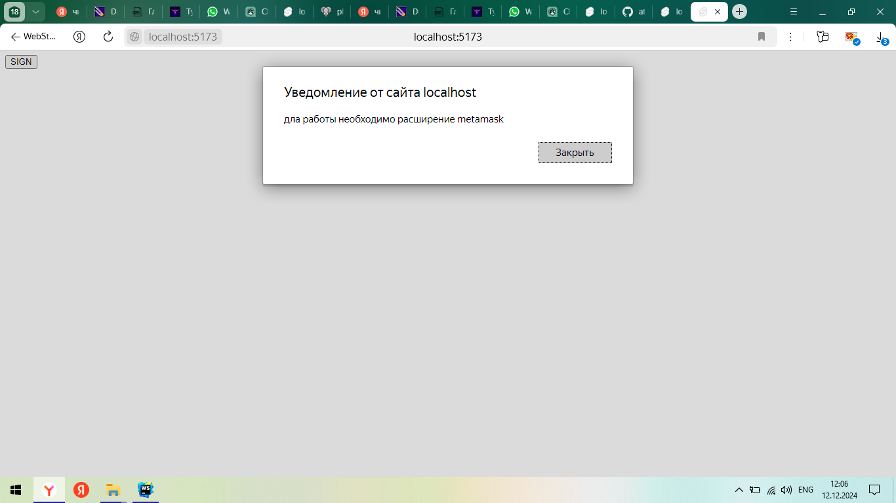
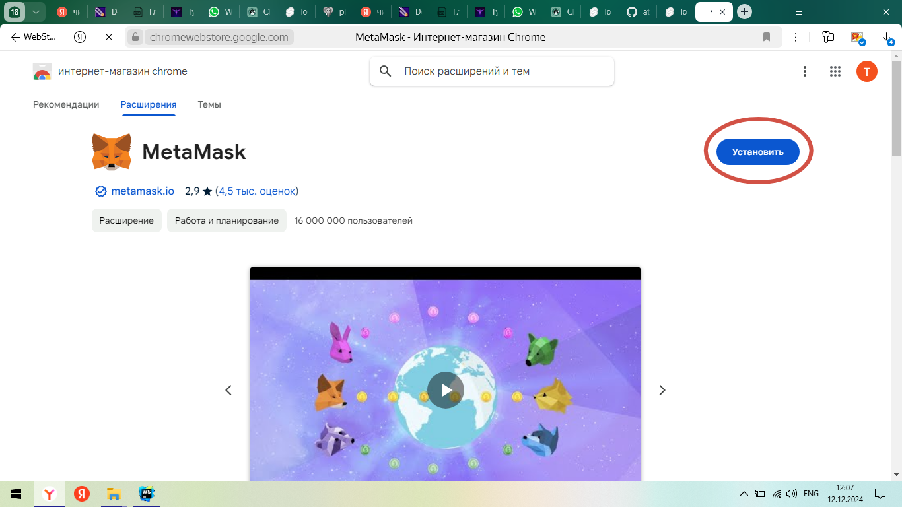
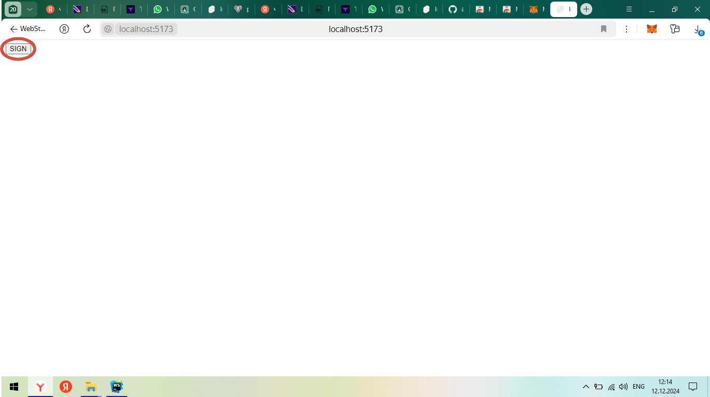
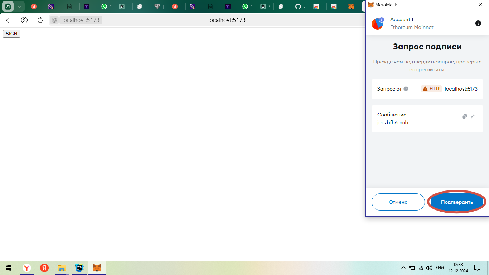
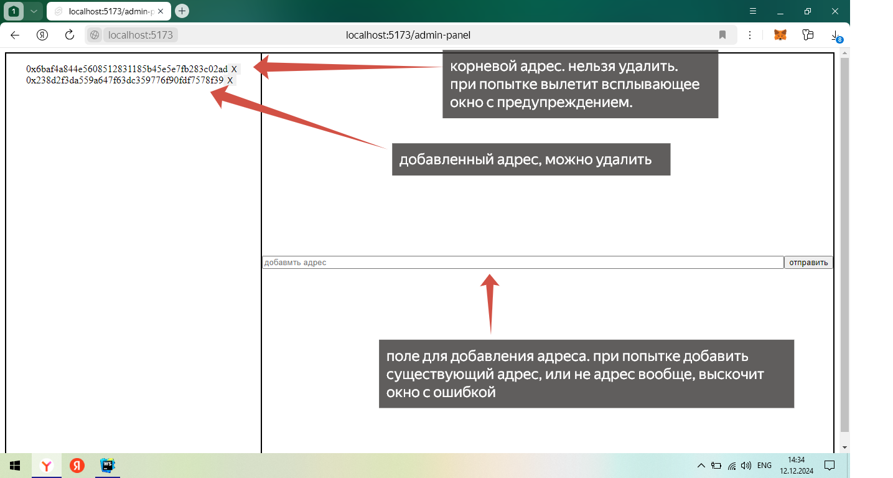

# Как работает ? 

### запуск (backend):
При запуске создается таблица с одной колонкой "address",
в которой хранятся адреса администраторов, она же первичный ключ.
В таблицу сразу же заносится "корневой адрес" взятый из .env файла.

### авторизация (backend)
На вход принимаются 3 параметра:
1. Случайная строка
2. Подписанная случайная строка
3. Публичный ключ

Адрес проверяется на валидность. Сообщение кодируется и с помощью 
сигнатуры восстанавливается публичный ключ, который сравнивается с
входящим. Если ключи равны - проверяется есть ли он в базе, если есть - чувачок аутентифицирован, для него генерируется
токен доступа, который должен быть предоставлен для любой приватной ручки.


Как таковой авторизации (предоставления прав доступа к ресурсу),
поэтому у приватных ручек отсутствует проверка зашитого в токен адреса и 
его дальнейшего использования. Любой пользователь предоставивший валидный
токен считается администратором со всеми привелегиями (по условию).


### Остальной функционал (backend)
Авторизованный пользователь (администратор), может добавлять другие адреса 
которые так же будут с админскими правами (адреса проверяются на валидность при добавлении),
Нельзя добавить один и тот же адрес дважды. Так же можно удалять адреса из базы, если адрес не корневой.
Можно получить список всех добавленных адресов.

### Переменные окружения (.env)
##### token configuration
* **ACCESS_TOKEN_EXPIRE_MINUTES** - время жизни токена доступа в минутах
* **REFRESH_TOKEN_EXPIRE_HOURS** - время жизни токена обновления в часах (не используется)
* **TOKEN_SECRET_KEY** - секретный ключ для подписи токена

##### server configuration
* **SERVER_HOST** - хост сервера
* **SERVER_PORT** - порт сервера
* **DEBUG** - режим запуска (влияет на количество логов)

##### postgresql configuration
* **POSTGRES_PASSWORD** - пароль к базе данных
* **POSTGRES_USER** - имя пользователя базы данных
* **POSTGRES_DB** - имя базы данных
* **POSTGRES_SOCKET** - хост:порт базы данных

##### web 3
* **ETH_NODE_HTTP_PROVIDER_URI** - адрес провайдера
* **ROOT_ADDRESS** - корневой адрес

*пример .env файла присутсвует*

### фронтенд
Корневая страница представляет собой одну крохотную кнопку,
которая и авторизует пользователя, для успешной работы фронта нужен установленный плагин *MetaMask*
(проверено только на google и yandex chrome). Если плагин не установлен фронт автоматически переадресует
на страницу установки плагина (гарантии нет но должно быть все автоаматом). 
При установленном плагине, нажатие на кнопку открывает окно плагина с предложнием подписать случайную строку
(при условии что пользователь авторизован в аккаунте metamask, либо нужно сначала авторизоваться (восстановить адрес/создать новый адрес)).
При попытке авторизоваться с адреса, которого нет в базе вылетит окно с надписью "вы не админ".


После успешной авторизации откроется "админ панель".
Слева список всех адресов в базе с кнопками на удаление, 
справа форма для добавления нового адреса. При получении на любой запрос 401 кода
будет переадресация на главную страницу с кнопкой авторизации.


На некоторые действия так же настоены всплывающие окна, например при попытке добавить невалидный адрес.
остальные ошибки просто выводятся в консоль.

### Переменные окружения (.env)
***PUBLIC_SERVER_URI*** - адрес сервера (бэкенда)


# Как запустить (бэкенд) ?
Для начала нужно заполнить переменные окружения (файл *src/services/backend/.env*).
Запустить СУБД (используется PostgreSQL) ,
настроить вход с параметрами, которые вы указали в файле .env .


Бэкенд находится в папке *src/services/backend* , перейдите в эту папку, 
создайте виртуальное окружение, установите зависимости командой 
```pip install -r requirements.txt``` .
Дождитесь установки необходимых библиотек и запустите сервер командой 
```python main.py```. 
Если все настроено правильно, увидете примерно такое ,
Если не правильно, например недоступна база (неправильные настройки подключения или база отключена) такое:


# Как запустить (фронтенд) ?
Отредактировать переменную окружения (файл *src/services/frontend/.env*) .
Перейдите в папку *src/services/frontend*, установите зависимости командой 
```npm i```. Дождитесь установки зависимостей. запустите сервер фронта
(сервер разработки . . никаких прокси и статических серверов не предусмотрено, поэтому так).
командой ```npm run dev```.
При успешном запуске будет чтото такое: .


### Примеры

при неустановленном плагине Metamask 
переадресовывает сюда 
жмем **установить** .
Желательно перезапусить браузер после установки (без этого может не работать).
после жмем на кнопку 
подписываем сообщение 
если все хорошо и такой адрес есть в базе попадаем сюда 


### Чего нет ?
Бэкенд очень упрощен. Нет кеша, нет оптимизации производительности, 
нет расширенной безопасности, нет логирования (такого которое должно быть), 
не все исключения обрабатываются. 
Суть всей программы по факту показать работу одного единственного метода ))


